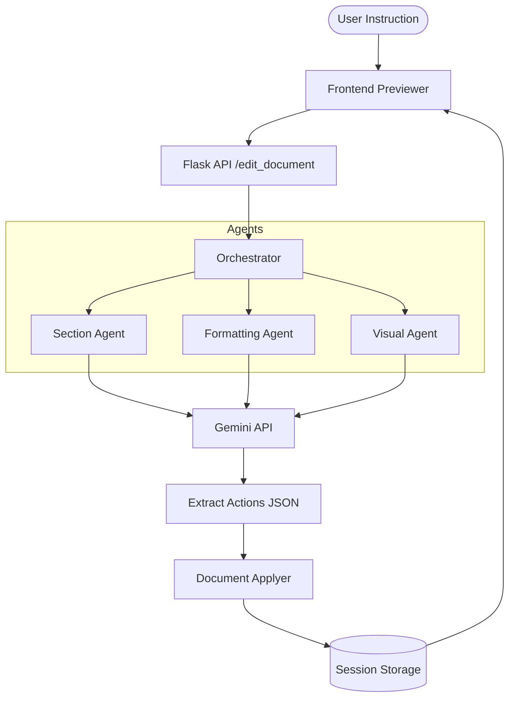
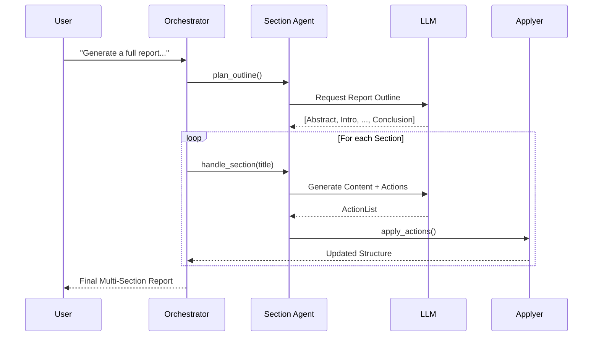

# Repora System Architecture

This document provides a technical overview of the Repora system design, its core components, and the orchestration logic that enables natural language document editing.

## High-Level Overview

Repora follows a modular agentic architecture designed to translate high-level user instructions into precise document manipulations.

---

## Core Components

### 1. Orchestrator (`doc_editor/agents/orchestrator.py`)
The Orchestrator is the central brain of the system. It analyzes the user's intent and routes the request to the appropriate specialized agent.
- **Routing Logic**: Uses keyword analysis and instruction context to decide which agent to invoke.
- **Context Enrichment**: Injects document metadata (topic, institution, reference text) into the workflow.
- **Batch Management**: Triggers multi-step generation workflows for "Full Report" requests.

### 2. Specialized Agents (`doc_editor/agents/`)
- **Section Agent**: Responsible for content generation, expansion, and rewriting. It can plan out predefined report structures.
- **Formatting Agent**: Handles style compliance (e.g., font sizes, headings, academic styles like IEEE/APA).
- **Visual Agent**: Focuses on structural elements like diagrams (Mermaid) and tabular data.

### 3. LLM Integration (`doc_editor/llm.py`)
All agents communicate with Gemini to perform "Action Extraction". Instead of just generating text, Repora instructs the LLM to return a structured `ActionList`.
- **Structured Output**: Uses Pydantic models to ensure the LLM returns valid JSON.
- **Self-Healing**: Implements robust JSON extraction and repair logic to handle messy LLM outputs.

### 4. Document Applyer (`doc_editor/applyer.py`)
The Applyer is the execution engine. It takes the `ActionList` and applies changes to the internal document model (`full_structure`).
- **Support Actions**: `INSERT_BEFORE`, `INSERT_AFTER`, `REPLACE`, `DELETE`, `MODIFY_STYLE`.
- **Atomic Operations**: Ensures that document structure remains valid after every manipulation.

---

## Core Workflows

### Single Edit Workflow
When a user provides a specific instruction (e.g., *"Make the first paragraph bold"*):
1. **Orchestrator** identifies it as a formatting request.
2. **Formatting Agent** fetches the current document structure and crafts a prompt for Gemini.
3. **Gemini** returns a `MODIFY_STYLE` action.
4. **Applyer** executes the action on the target paragraph.
5. **UI** refreshes to show the updated preview.

### Batch Generation Workflow
For requests like *"Write a full report on Quantum Computing"*:

---

## Data Model: The Action Schema

Repora uses a normalized JSON representation of document elements. Edits are performed via an `Action` object:

| Field | Description |
| :--- | :--- |
| `type` | The action type (`INSERT_AFTER`, `REPLACE`, etc.) |
| `target_pid` | The unique ID of the document element to act upon. |
| `content` | The new text or object content to insert/replace. |
| `metadata` | Optional styling or structural metadata. |

---

*For more information on running the project, see [README.md](README.md).*
